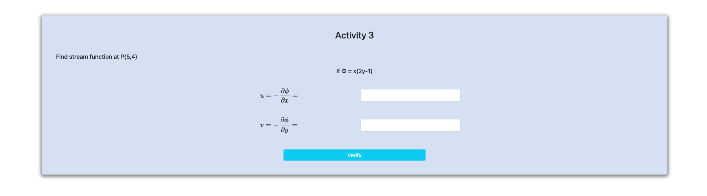

<h2>Follow the below steps to perform the experiment on the simulator</h2>
 

Step 1 : Click next to start.

Step 2 : Enter the expression

Step 3 : Enter the expression

Step 4 : Calculate partial differentiation

Step 5 : Enter the expression

Step 6 : Calculate resultant and theta 

Step 7 : Enter the partial differentiation 

Step 8 : Enter the expression 

Step 9 : Enter the integration 

Step 10 : Calculate 

